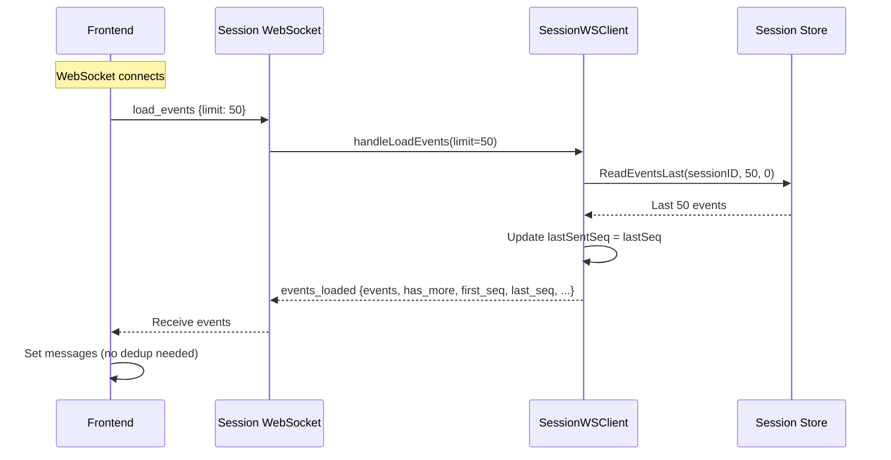
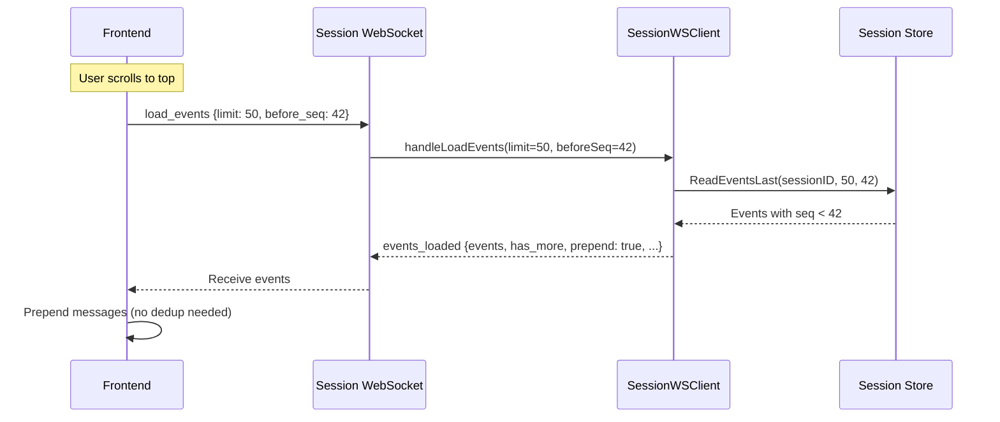
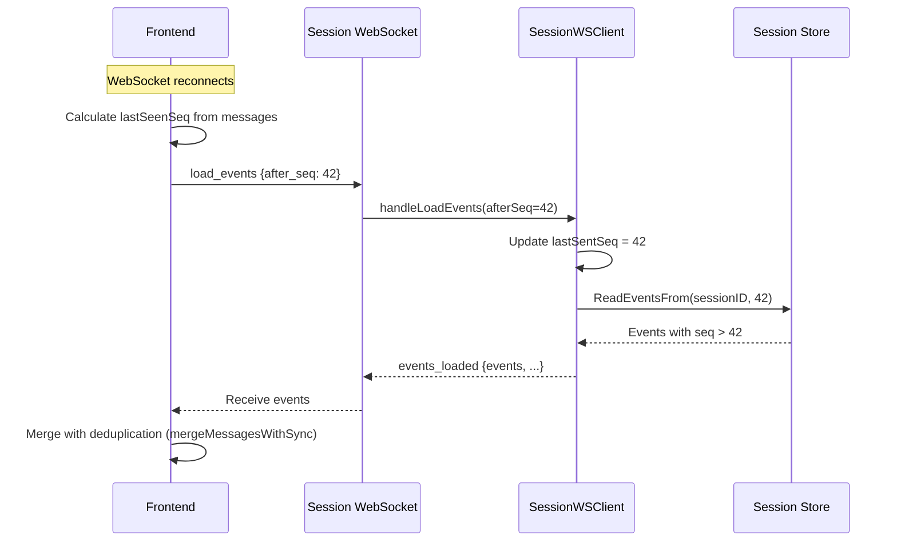
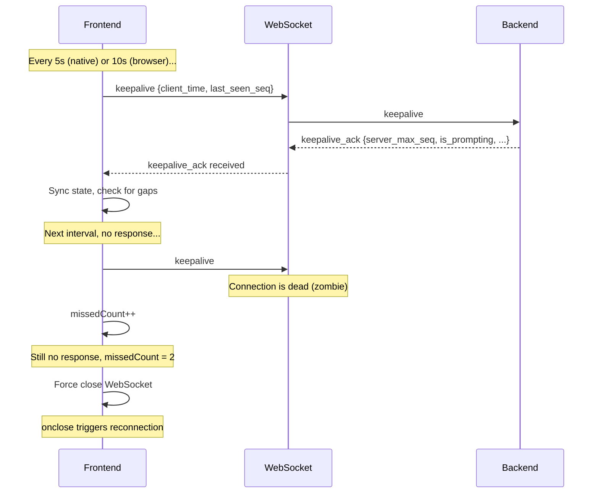
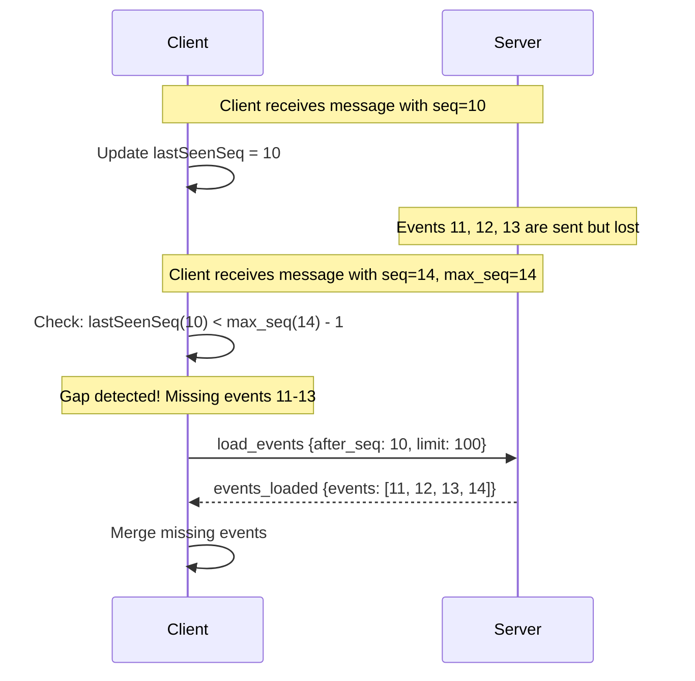

# WebSocket Synchronization and Reconnection

This document covers how clients synchronize with the server, handle reconnections, and recover from various edge cases including zombie connections.

## Related Documentation

- [Protocol Specification](./protocol-spec.md) - Message types and formats
- [Sequence Numbers](./sequence-numbers.md) - Ordering and deduplication
- [Communication Flows](./communication-flows.md) - Complete interaction flows

## Replay of Missing Content

When a client connects mid-stream (while the agent is actively responding), it needs to catch up on content that has been streamed but not yet persisted.

### The Problem

Agent messages and thoughts are **buffered** during streaming and only **persisted** when the prompt completes. A client connecting mid-stream would miss buffered content.

### The Solution

When a new observer connects to a `BackgroundSession`, the session checks if it's currently prompting. If so, it sends any buffered thought and message content to the new observer using `Peek()` (which reads without clearing the buffer).

**Key methods in `agentMessageBuffer`:**

- `Peek()`: Returns buffer content without clearing it
- `Flush()`: Returns buffer content and clears it (used at prompt completion)

## WebSocket-Only Event Loading

The frontend uses a **WebSocket-only architecture** for loading events. This eliminates race conditions between REST and WebSocket, simplifies deduplication, and provides a unified approach for initial load, pagination, and sync.

### Server-Side Deduplication

The server tracks `lastSentSeq` per WebSocket client to guarantee no duplicate events are sent:

```go
type SessionWSClient struct {
    lastSentSeq int64      // Highest seq sent to this client
    seqMu       sync.Mutex // Protects lastSentSeq
}
```

**Key properties:**

- Each observer callback checks `seq > lastSentSeq` before sending
- For streaming events, chunks with the same seq are allowed (continuations)
- After `load_events` response, `lastSentSeq` is updated to the highest seq returned (only if higher)
- **Critical**: `lastSentSeq` is never reset to 0 during fallback scenarios

### lastSentSeq Preservation

When `handleLoadEvents` falls back to initial load (due to client/server seq mismatch), the server **must not** reset `lastSentSeq` to 0. This prevents duplicate messages when buffered events are replayed.

```go
if afterSeq > serverMaxSeq {
    // Fall back to initial load - load last N events
    events, err = c.store.ReadEventsLast(c.sessionID, limit, 0)
    isPrepend = false
    // NOTE: We intentionally do NOT reset lastSentSeq here.
}
```

## Event Loading Flows

### Initial Load (on WebSocket connect)



### Pagination (load more older events)



### Sync (after reconnect)



## Deduplication Strategy

The system uses a **three-tier deduplication** approach:

1. **Server-side deduplication** (`lastSentSeq` tracking)
2. **Client-side seq deduplication** (`isSeqDuplicate`)
3. **Client-side content deduplication** (`mergeMessagesWithSync` + HTML safeguard)

### Streaming HTML Duplicate Safeguard

During streaming, multiple chunks with the same `seq` are coalesced. The `isSeqDuplicate` function allows same-seq events to pass through for coalescing:

```javascript
if (lastMessageSeq && seq === lastMessageSeq) return false;
```

Before appending, check if existing HTML already ends with incoming HTML:

```javascript
if (existingHtml.endsWith(incomingHtml)) {
  console.log("[DEBUG agent_message] Skipping duplicate append");
  return prev; // Skip duplicate append
}
```

### Client-side Merge Function

```javascript
export function mergeMessagesWithSync(existingMessages, newMessages) {
  // Create a map of existing messages by seq for fast lookup
  const existingBySeq = new Map();
  const existingHashes = new Set();
  for (const m of existingMessages) {
    if (m.seq) existingBySeq.set(m.seq, m);
    existingHashes.add(getMessageHash(m));
  }

  // Filter out duplicates from new messages
  const filteredNewMessages = newMessages.filter((m) => {
    if (m.seq && existingBySeq.has(m.seq)) return false;
    return !existingHashes.has(getMessageHash(m));
  });

  // Combine and sort by seq for correct ordering
  const allMessages = [...existingMessages, ...filteredNewMessages];
  allMessages.sort((a, b) => {
    if (a.seq && b.seq) return a.seq - b.seq;
    return 0;
  });

  return allMessages;
}
```

## Reconnection Handling

The reconnection system handles WebSocket disconnections gracefully, including the "zombie connection" problem on mobile devices.

### Automatic Reconnection on Close

When a WebSocket closes unexpectedly, the frontend schedules a reconnection after a 2-second delay. The reconnection only occurs if:

- The session is still the active session
- No newer WebSocket has been created for that session

Reconnections can be triggered by:

1. **Server-initiated close**: Server closes the connection
2. **Network failure**: Connection drops due to network issues
3. **Keepalive failure**: Client detects zombie connection via missed keepalives

### Pending Prompt Retry

Prompts are saved to localStorage before sending. After reconnection, prompts that weren't acknowledged are automatically retried. Prompts older than 5 minutes are cleaned up.

## Zombie Connection Detection (Keepalive)

On mobile devices, WebSocket connections can become "zombies" - they appear open but are actually dead.

### The Solution: Client-Side Keepalive with Sequence Sync

The frontend sends periodic `keepalive` messages that serve two purposes:

1. **Detect zombie connections** - Force reconnect if keepalives aren't acknowledged
2. **Detect out-of-sync state** - Compare sequence numbers to catch missed messages

### Configuration

```javascript
const KEEPALIVE_INTERVAL_NATIVE_MS = 5000; // Native app: every 5 seconds
const KEEPALIVE_INTERVAL_BROWSER_MS = 10000; // Browser: every 10 seconds
const KEEPALIVE_MAX_MISSED = 2; // Force reconnect after 2 missed
```

### Keepalive Flow



### Connection Health Check Before Sending

```javascript
const isConnectionHealthy = (sessionId) => {
  const keepalive = keepaliveRef.current[sessionId];
  if (!keepalive) return true;

  const timeSinceLastAck = Date.now() - (keepalive.lastAckTime || 0);
  return (
    timeSinceLastAck < getKeepaliveInterval() * 2 &&
    (keepalive.missedCount || 0) === 0
  );
};
```

## Immediate Gap Detection (max_seq Piggybacking)

While keepalive-based sync works well, it has latency of 5-10 seconds. For faster gap detection, all streaming messages include a `max_seq` field.

### How It Works

Every streaming message includes `max_seq`, the highest sequence number the server has. The client can immediately detect gaps:



### Implementation

**Server side** (`internal/web/session_ws.go`):

- All streaming messages include `max_seq` from `getServerMaxSeq()`
- `getServerMaxSeq()` returns `max(persisted_event_count, GetMaxAssignedSeq())`

**Client side** (`web/static/hooks/useWebSocket.js`):

- `checkAndFillGap(sessionId, maxSeq, msgSeq)` is called for each streaming message
- Gap fill requests are debounced (500ms) to avoid duplicate requests

### Messages That Include max_seq

- `agent_message`
- `agent_thought`
- `tool_call`
- `tool_update`
- `user_prompt`
- `prompt_complete`
- `events_loaded`
- `keepalive_ack`

## Exponential Backoff (M2 fix)

WebSocket reconnection uses exponential backoff with jitter:

```javascript
const RECONNECT_BASE_DELAY_MS = 1000; // 1 second initial
const RECONNECT_MAX_DELAY_MS = 30000; // 30 second max
const RECONNECT_JITTER_FACTOR = 0.3; // 30% random jitter

function calculateReconnectDelay(attempt) {
  const exponentialDelay = Math.min(
    RECONNECT_BASE_DELAY_MS * Math.pow(2, attempt),
    RECONNECT_MAX_DELAY_MS,
  );
  const jitter = exponentialDelay * RECONNECT_JITTER_FACTOR * Math.random();
  return Math.floor(exponentialDelay + jitter);
}
```
