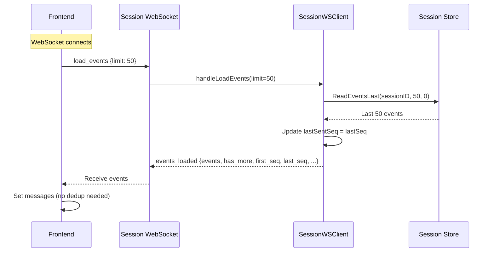
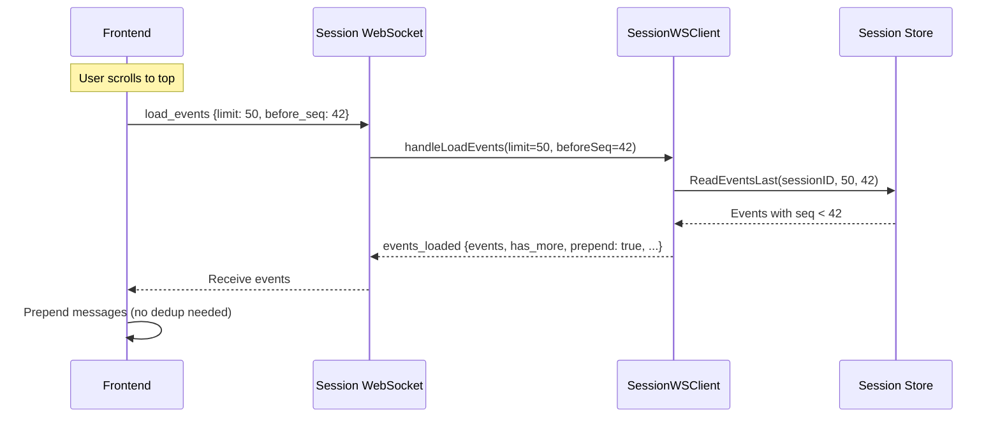
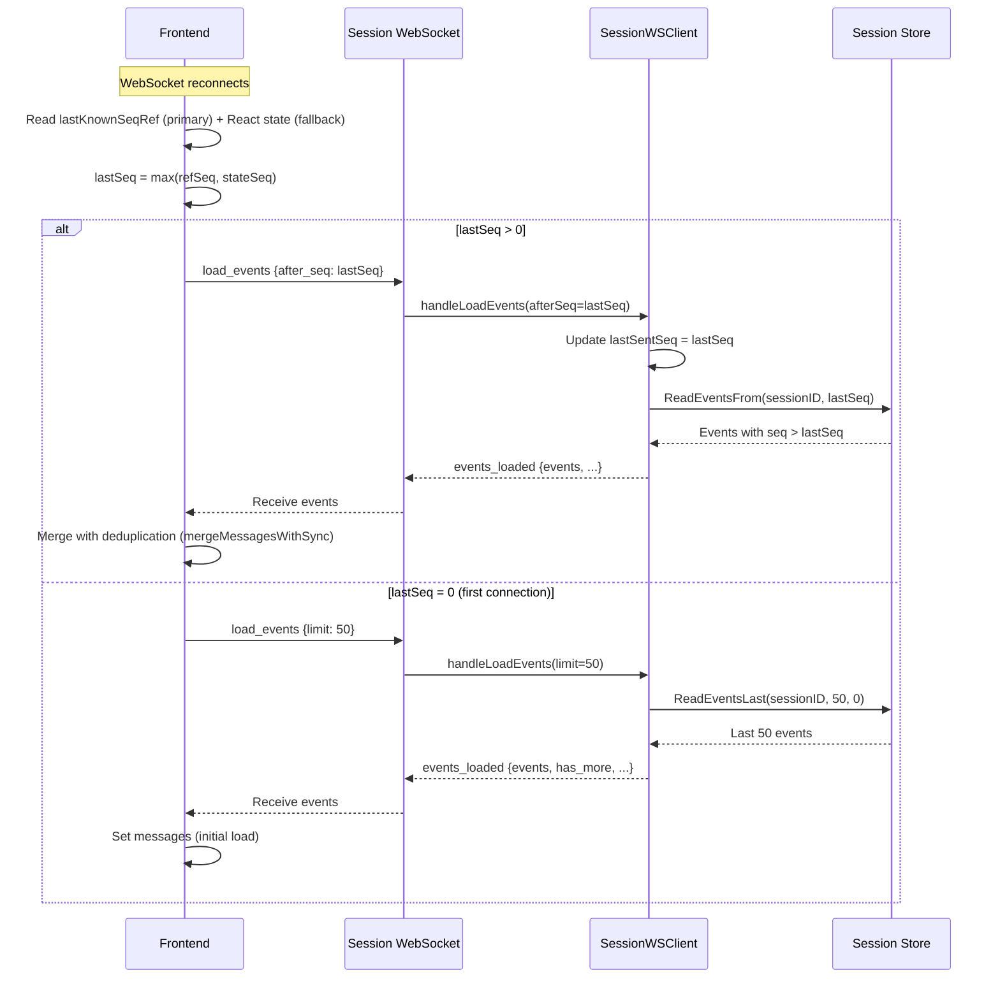
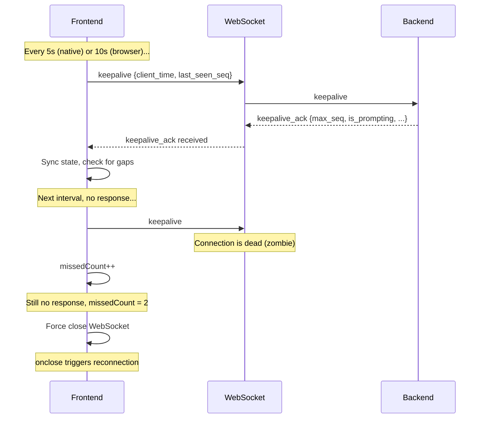
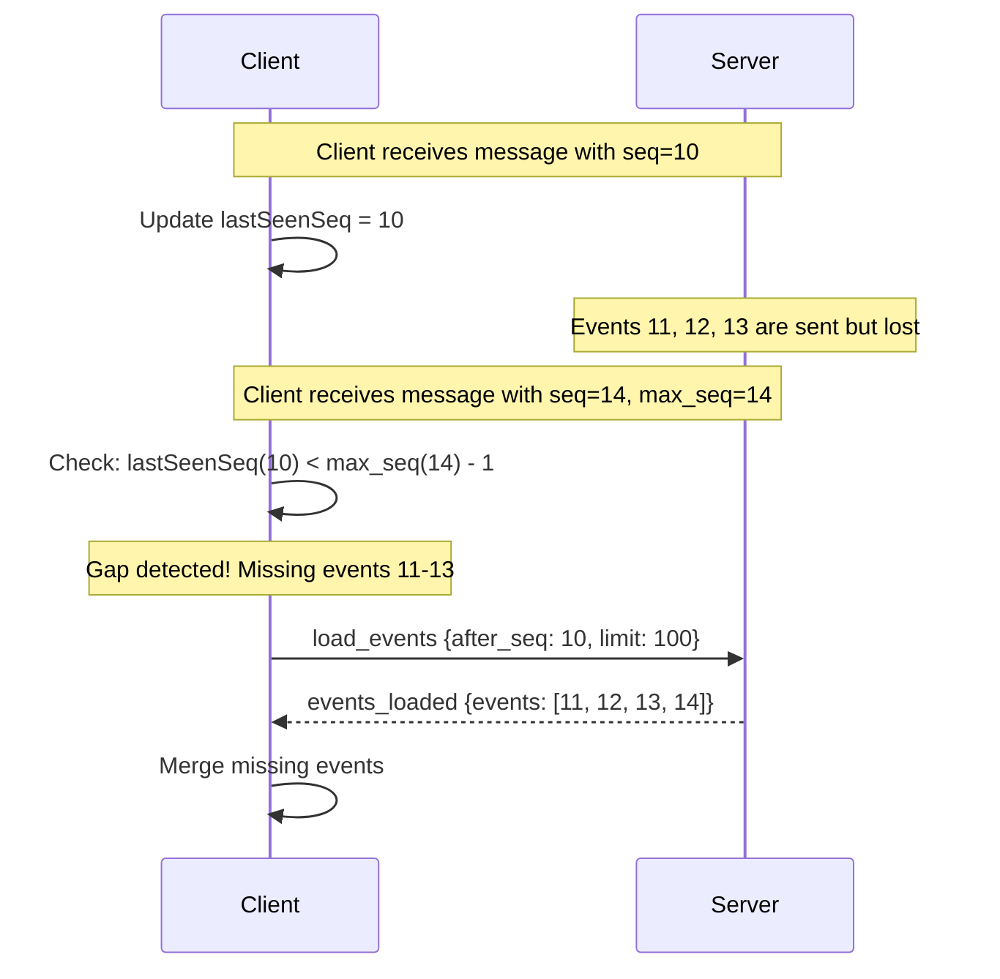

# WebSocket Synchronization and Reconnection

This document covers how clients synchronize with the server, handle reconnections, and recover from various edge cases including zombie connections.

## Related Documentation

- [Protocol Specification](./protocol-spec.md) — Message types and formats
- [Sequence Numbers](./sequence-numbers.md) — Ordering and deduplication
- [Communication Flows](./communication-flows.md) — Complete interaction flows

## Replay of Missing Content

When a client connects mid-stream (while the agent is actively responding), it needs to catch up on content that has been streamed but not yet persisted.

### The Problem

Agent messages and thoughts are **buffered** during streaming and only **persisted** when the prompt completes. A client connecting mid-stream would miss buffered content.

### The Solution

When a new observer connects to a `BackgroundSession`, the session checks if it's currently prompting. If so, it sends any buffered thought and message content to the new observer using `Peek()` (which reads without clearing the buffer).

**Key methods in `agentMessageBuffer`:**

- `Peek()`: Returns buffer content without clearing it
- `Flush()`: Returns buffer content and clears it (used at prompt completion)

## WebSocket-Only Event Loading

The frontend uses a **WebSocket-only architecture** for loading events. This eliminates race conditions between REST and WebSocket, simplifies deduplication, and provides a unified approach for initial load, pagination, and sync.

### Server-Side Deduplication

The server tracks `lastSentSeq` per WebSocket client to guarantee no duplicate events are sent:

```go
type SessionWSClient struct {
    lastSentSeq int64      // Highest seq sent to this client
    seqMu       sync.Mutex // Protects lastSentSeq
}
```

**Key properties:**

- Each observer callback checks `seq > lastSentSeq` before sending
- For streaming events, chunks with the same seq are allowed (continuations)
- After `load_events` response, `lastSentSeq` is updated to the highest seq returned (only if higher)
- **Critical**: `lastSentSeq` is never reset to 0 during fallback scenarios

### lastSentSeq Preservation

When `handleLoadEvents` falls back to initial load (due to client/server seq mismatch), the server **must not** reset `lastSentSeq` to 0. This prevents duplicate messages when buffered events are replayed.

```go
if afterSeq > serverMaxSeq {
    // Fall back to initial load - load last N events
    events, err = c.store.ReadEventsLast(c.sessionID, limit, 0)
    isPrepend = false
    // NOTE: We intentionally do NOT reset lastSentSeq here.
}
```

## Event Loading Flows

### Initial Load (on WebSocket connect)


```mermaid
sequenceDiagram
    participant Client as Frontend
    participant WS as Session WebSocket
    participant Handler as SessionWSClient
    participant Store as Session Store

    Note over Client: WebSocket connects
    Client->>WS: load_events {limit: 50}
    WS->>Handler: handleLoadEvents(limit=50)
    Handler->>Store: ReadEventsLast(sessionID, 50, 0)
    Store-->>Handler: Last 50 events
    Handler->>Handler: Update lastSentSeq = lastSeq
    Handler-->>WS: events_loaded {events, has_more, first_seq, last_seq, ...}
    WS-->>Client: Receive events
    Client->>Client: Set messages (no dedup needed)
```

### Pagination (load more older events)


```mermaid
sequenceDiagram
    participant Client as Frontend
    participant WS as Session WebSocket
    participant Handler as SessionWSClient
    participant Store as Session Store

    Note over Client: User scrolls to top
    Client->>WS: load_events {limit: 50, before_seq: 42}
    WS->>Handler: handleLoadEvents(limit=50, beforeSeq=42)
    Handler->>Store: ReadEventsLast(sessionID, 50, 42)
    Store-->>Handler: Events with seq < 42
    Handler-->>WS: events_loaded {events, has_more, prepend: true, ...}
    WS-->>Client: Receive events
    Client->>Client: Prepend messages (no dedup needed)
```

### Sync (after reconnect)


```mermaid
sequenceDiagram
    participant Client as Frontend
    participant WS as Session WebSocket
    participant Handler as SessionWSClient
    participant Store as Session Store

    Note over Client: WebSocket reconnects
    Client->>Client: Read lastKnownSeqRef (primary) + React state (fallback)
    Client->>Client: lastSeq = max(refSeq, stateSeq)
    alt lastSeq > 0
        Client->>WS: load_events {after_seq: lastSeq}
        WS->>Handler: handleLoadEvents(afterSeq=lastSeq)
        Handler->>Handler: Update lastSentSeq = lastSeq
        Handler->>Store: ReadEventsFrom(sessionID, lastSeq)
        Store-->>Handler: Events with seq > lastSeq
        Handler-->>WS: events_loaded {events, ...}
        WS-->>Client: Receive events
        Client->>Client: Merge with deduplication (mergeMessagesWithSync)
    else lastSeq = 0 (first connection)
        Client->>WS: load_events {limit: 50}
        WS->>Handler: handleLoadEvents(limit=50)
        Handler->>Store: ReadEventsLast(sessionID, 50, 0)
        Store-->>Handler: Last 50 events
        Handler-->>WS: events_loaded {events, has_more, ...}
        WS-->>Client: Receive events
        Client->>Client: Set messages (initial load)
    end
```

**Sequence source priority on reconnection:**

The `ws.onopen` handler determines `lastSeq` using two sources:

1. **`lastKnownSeqRef`** (primary): A `useRef` updated on every received event. Survives reconnections, always current. Not affected by React state resets.
2. **React state** (fallback): `Math.max(getMaxSeq(session.messages), session.lastLoadedSeq)`. May be empty/stale during reconnection but provides a safety net.

The final value is `Math.max(refSeq, stateSeq)`. If both are 0, this is a first connection and the initial-load path is used.

## Deduplication Strategy

The system uses a **three-tier deduplication** approach:

1. **Server-side deduplication** (`lastSentSeq` tracking)
2. **Client-side seq deduplication** (`isSeqDuplicate`)
3. **Client-side content deduplication** (`mergeMessagesWithSync` + HTML safeguard)

### Streaming HTML Duplicate Safeguard

During streaming, multiple chunks with the same `seq` are coalesced. The `isSeqDuplicate` function allows same-seq events to pass through for coalescing:

```javascript
if (lastMessageSeq && seq === lastMessageSeq) return false;
```

Before appending, check if existing HTML already ends with incoming HTML:

```javascript
if (existingHtml.endsWith(incomingHtml)) {
  console.log("[DEBUG agent_message] Skipping duplicate append");
  return prev; // Skip duplicate append
}
```

### Client-side Merge Function

```javascript
export function mergeMessagesWithSync(existingMessages, newMessages) {
  // Create a map of existing messages by seq for fast lookup
  const existingBySeq = new Map();
  const existingHashes = new Set();
  for (const m of existingMessages) {
    if (m.seq) existingBySeq.set(m.seq, m);
    existingHashes.add(getMessageHash(m));
  }

  // Filter out duplicates from new messages
  const filteredNewMessages = newMessages.filter((m) => {
    if (m.seq && existingBySeq.has(m.seq)) return false;
    return !existingHashes.has(getMessageHash(m));
  });

  // Combine and sort by seq for correct ordering
  const allMessages = [...existingMessages, ...filteredNewMessages];
  allMessages.sort((a, b) => {
    if (a.seq && b.seq) return a.seq - b.seq;
    return 0;
  });

  return allMessages;
}
```

## Reconnection Handling

The reconnection system handles WebSocket disconnections gracefully, including the "zombie connection" problem on mobile devices.

### Automatic Reconnection on Close

When a WebSocket closes unexpectedly, the frontend schedules a reconnection after a 2-second delay. The reconnection only occurs if:

- The session is still the active session
- No newer WebSocket has been created for that session

Reconnections can be triggered by:

1. **Server-initiated close**: Server closes the connection
2. **Network failure**: Connection drops due to network issues
3. **Keepalive failure**: Client detects zombie connection via missed keepalives

### Pending Prompt Retry

Prompts are saved to localStorage before sending. After reconnection, prompts that weren't acknowledged are automatically retried. Prompts older than 5 minutes are cleaned up.

## Zombie Connection Detection (Keepalive)

On mobile devices, WebSocket connections can become "zombies" - they appear open but are actually dead.

### The Solution: Client-Side Keepalive with Sequence Sync

The frontend sends periodic `keepalive` messages that serve two purposes:

1. **Detect zombie connections** - Force reconnect if keepalives aren't acknowledged
2. **Detect out-of-sync state** - Compare sequence numbers to catch missed messages

### Configuration

```javascript
const KEEPALIVE_INTERVAL_NATIVE_MS = 5000; // Native app: every 5 seconds
const KEEPALIVE_INTERVAL_BROWSER_MS = 10000; // Browser: every 10 seconds
const KEEPALIVE_MAX_MISSED = 2; // Force reconnect after 2 missed
```

### Keepalive Flow


```mermaid
sequenceDiagram
    participant Frontend
    participant WS as WebSocket
    participant Server as Backend

    Note over Frontend: Every 5s (native) or 10s (browser)...
    Frontend->>WS: keepalive {client_time, last_seen_seq}
    WS->>Server: keepalive
    Server-->>WS: keepalive_ack {max_seq, is_prompting, ...}
    WS-->>Frontend: keepalive_ack received
    Frontend->>Frontend: Sync state, check for gaps

    Note over Frontend: Next interval, no response...
    Frontend->>WS: keepalive
    Note over WS: Connection is dead (zombie)
    Frontend->>Frontend: missedCount++

    Note over Frontend: Still no response, missedCount = 2
    Frontend->>Frontend: Force close WebSocket
    Note over Frontend: onclose triggers reconnection
```

### Keepalive Sync Tolerance

The keepalive sync uses a tolerance to avoid excessive sync requests during active streaming,
where the markdown buffer may temporarily hold unflushed content:

```javascript
const KEEPALIVE_SYNC_TOLERANCE = 2; // Only applies during streaming
```

- **During streaming** (`isStreaming=true`): Tolerance of 2 is applied for logging. When the client is behind by more than 2, a debug log is emitted (`"requesting sync"`) but sync is **skipped** (hard break) — events arrive via the observer pattern in real-time, and any remaining gap is resolved at `prompt_complete` via `checkAndFillGap()` and the `max_seq` piggybacking mechanism.

  The log message correctly indicates: `"Skipping sync for {sessionId} — stream in progress"` when streaming is active.

- **When not streaming** (`isStreaming=false`): Tolerance of 0 — any gap triggers sync immediately.
  This ensures events written during session close (like `session_end`) are delivered promptly.

This distinction is critical because `session_end` events are persisted by `recorder.End()` during
`BackgroundSession.Close()`, but are NOT delivered via the observer pattern. They can only reach
the client through the keepalive sync or load_events mechanism.

### Connection Health Check Before Sending

```javascript
const isConnectionHealthy = (sessionId) => {
  const keepalive = keepaliveRef.current[sessionId];
  if (!keepalive) return true;

  const timeSinceLastAck = Date.now() - (keepalive.lastAckTime || 0);
  return (
    timeSinceLastAck < getKeepaliveInterval() * 2 &&
    (keepalive.missedCount || 0) === 0
  );
};
```

**Sequence Number Source**: The keepalive handler uses `lastKnownSeqRef` as the **primary source** for `clientMaxSeq`, with React state (`getMaxSeq(session.messages)` and `session.lastLoadedSeq`) as a fallback:

```javascript
const refSeq = lastKnownSeqRef.current[sessionId] || 0;
const stateSeq = Math.max(
  getMaxSeq(session.messages),
  session.lastLoadedSeq || 0
);
const clientMaxSeq = Math.max(refSeq, stateSeq);
```

This ensures accurate gap detection even when React state is temporarily empty during reconnection or fast reconnects.

## Immediate Gap Detection (max_seq Piggybacking)

While keepalive-based sync works well, it has latency of 5-10 seconds. For faster gap detection, all streaming messages include a `max_seq` field.

### How It Works

Every streaming message includes `max_seq`, the highest sequence number the server has. The client can immediately detect gaps:


```mermaid
sequenceDiagram
    participant Client
    participant Server

    Note over Client,Server: Client receives message with seq=10
    Client->>Client: Update lastSeenSeq = 10

    Note over Server: Events 11, 12, 13 are sent but lost

    Note over Client,Server: Client receives message with seq=14, max_seq=14
    Client->>Client: Check: lastSeenSeq(10) < max_seq(14) - 1
    Note over Client: Gap detected! Missing events 11-13
    Client->>Server: load_events {after_seq: 10, limit: 100}
    Server-->>Client: events_loaded {events: [11, 12, 13, 14]}
    Client->>Client: Merge missing events
```

### Implementation

**Server side** (`internal/web/session_ws.go`):

- All streaming messages include `max_seq` from `getServerMaxSeq()`
- `getServerMaxSeq()` returns `max(persisted_event_count, GetMaxAssignedSeq())`

**Client side** (`web/static/hooks/useWebSocket.js`):

- `checkAndFillGap(sessionId, maxSeq, msgSeq)` is called for each streaming message
- Gap fill requests are debounced (500ms) to avoid duplicate requests
- `clientMaxSeq` is calculated using `lastKnownSeqRef` (primary) + React state (fallback): `Math.max(refSeq, stateSeq)`

### Messages That Include max_seq

- `agent_message`
- `agent_thought`
- `tool_call`
- `tool_update`
- `user_prompt`
- `prompt_complete`
- `events_loaded`
- `keepalive_ack`

## Circuit Breaker: Terminal Session Errors

When a session is deleted (or never existed), the server sends a `session_gone` message instead of a generic `error`. This is a **terminal signal** — the client MUST stop all reconnection attempts for that session immediately.

### The Problem

Without a circuit breaker, a deleted session causes an error storm: the client reconnects up to 15 times over ~3.5 minutes, each attempt generating a filesystem lookup and error log. If two requestors (WebSocket + REST polling) are active, this doubles to ~9.5 errors/second.

### Server-Side: Negative Session Cache

The server maintains a `NegativeSessionCache` — a thread-safe TTL cache (30 seconds) for session IDs known to not exist. This prevents repeated filesystem lookups for deleted sessions:

1. **First request**: Server checks memory → checks store → session not found → caches the negative result → sends `session_gone`
2. **Subsequent requests** (within 30s): Server checks memory → checks negative cache → cache hit → sends `session_gone` immediately (no filesystem I/O)

The cache is invalidated when a session is created (`handleCreateSession`) or resumed (`ResumeSession`), preventing stale entries from blocking legitimate reconnections.

### Server-Side: `session_gone` Message

When the server detects a session doesn't exist (neither in memory nor in the store), it sends:

```json
{
  "type": "session_gone",
  "data": {
    "session_id": "session-123",
    "reason": "session not found"
  }
}
```

After sending `session_gone`, the server closes the WebSocket connection (with a 100ms delay to allow the message to flush).

This replaces the previous behavior where `handleLoadEvents` would send a generic `error` message with "Session not found", which clients did not treat as terminal.

### Client-Side: Three-Layer Protection

The client uses defense-in-depth to detect terminal session errors:

1. **Explicit `session_gone` handler**: The `handleSessionMessage` function has a dedicated `case "session_gone"` that calls `handleSessionGone()` immediately.

2. **Defense-in-depth in `error` handler**: The `case "error"` handler checks if the error message contains "session not found" using `isTerminalSessionError()`. This provides backward compatibility with older servers that haven't been updated.

3. **REST existence check on reconnect**: In the `ws.onclose` handler, before scheduling a reconnect, the client calls `checkSessionExists()` via REST API — not just when `!ws._wasOpen` (server rejected upgrade) but also after any failed reconnect attempt (`attempt >= 1`). If the session doesn't exist, `handleSessionGone()` is called.

### `handleSessionGone()` Behavior

When a session is determined to be gone, `handleSessionGone()`:

- Cancels any pending reconnect timers for the session
- Closes and cleans up the WebSocket connection
- Clears reconnect attempt counter and keepalive state
- Clears seen sequence numbers
- Removes the session from stored sessions
- Switches the UI to another available session (or shows "new conversation")

### Edge Cases

| Scenario                                   | Behavior                                                                                                    |
| ------------------------------------------ | ----------------------------------------------------------------------------------------------------------- |
| **Archived session**                       | Store lookup succeeds (metadata exists) → NOT cached as not-found, session loads normally in read-only mode |
| **Session recreated after deletion**       | `Remove()` called on create/resume invalidates negative cache → next connection succeeds                    |
| **Multiple clients for same dead session** | First client populates negative cache; subsequent clients get fast-path rejection (no filesystem I/O)       |
| **Old client, new server**                 | Old clients ignore unknown `session_gone` type; 15-attempt limit still applies                              |
| **New client, old server**                 | Defense-in-depth catches "Session not found" in `error` messages                                            |

## Exponential Backoff (M2 fix)

WebSocket reconnection uses exponential backoff with jitter:

```javascript
const RECONNECT_BASE_DELAY_MS = 1000; // 1 second initial
const RECONNECT_MAX_DELAY_MS = 30000; // 30 second max
const RECONNECT_JITTER_FACTOR = 0.3; // 30% random jitter

function calculateReconnectDelay(attempt) {
  const exponentialDelay = Math.min(
    RECONNECT_BASE_DELAY_MS * Math.pow(2, attempt),
    RECONNECT_MAX_DELAY_MS,
  );
  const jitter = exponentialDelay * RECONNECT_JITTER_FACTOR * Math.random();
  return Math.floor(exponentialDelay + jitter);
}
```

The attempt counter is shared between `forceReconnectActiveSession` and `onclose`, so repeated failures accumulate delay correctly. The counter is reset to 0 on successful connection (`ws.onopen`).

## WebSocket Close Codes

The following WebSocket close codes are relevant to the reconnection flow:

| Code | Name             | Meaning                                                 | Sent By                                |
| ---- | ---------------- | ------------------------------------------------------- | -------------------------------------- |
| 1000 | Normal Closure   | Clean shutdown, send channel closed                     | Server (WritePump)                     |
| 1001 | Going Away       | Server shutting down, ping failed, or context cancelled | Server (WritePump)                     |
| 1006 | Abnormal Closure | Connection closed without a close frame (TCP teardown)  | Protocol-level (not sent explicitly)   |
| 3001 | Force Reconnect  | Client-initiated forced reconnection                    | Client (`forceReconnectActiveSession`) |

### Server-Side Close Frame Behavior (`ws_conn.go` WritePump)

The `WritePump` goroutine sends close frames in these exit paths:

| Exit Path                           | Close Code           | Close Reason        |
| ----------------------------------- | -------------------- | ------------------- |
| Send channel closed (`!ok`)         | 1000 (NormalClosure) | `""`                |
| Ping write failed                   | 1001 (GoingAway)     | `"ping failed"`     |
| Context cancelled (readPump exited) | 1001 (GoingAway)     | `"server shutdown"` |

**Note:** Close frame sending on ping failure and context cancellation is best-effort — the write may fail if the connection is already degraded, which results in the client seeing code 1006 (Abnormal Closure) instead.

### Client-Side Close Handling

When the client receives a close event:

- **Code 1000/1001**: Normal close. Reconnect with standard backoff.
- **Code 1006**: Abnormal closure. The connection died without a proper handshake. Reconnect with backoff.
- **Code 3001**: Client-initiated force reconnect. The `forceReconnectActiveSession` function pre-deletes the WS ref before closing to prevent `onclose` from scheduling a duplicate reconnect.

All reconnection paths read `lastKnownSeqRef` to determine the correct `after_seq` for the sync request.
