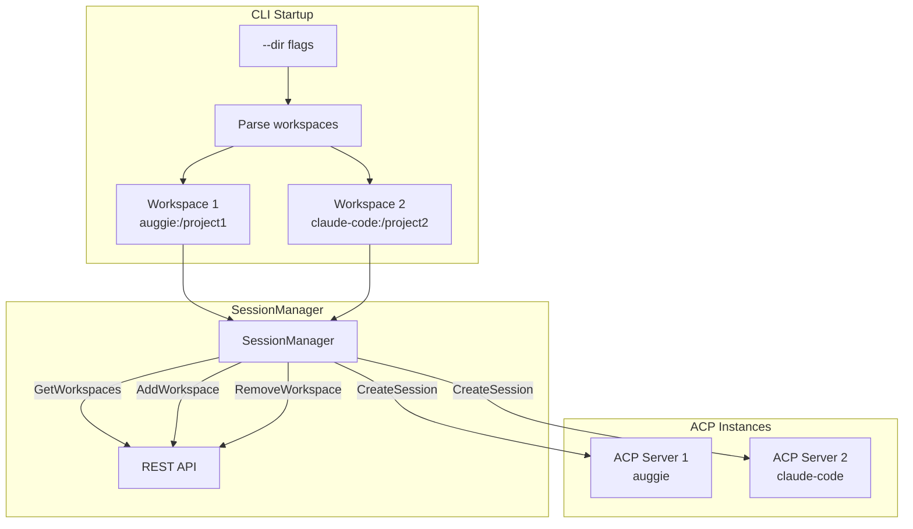
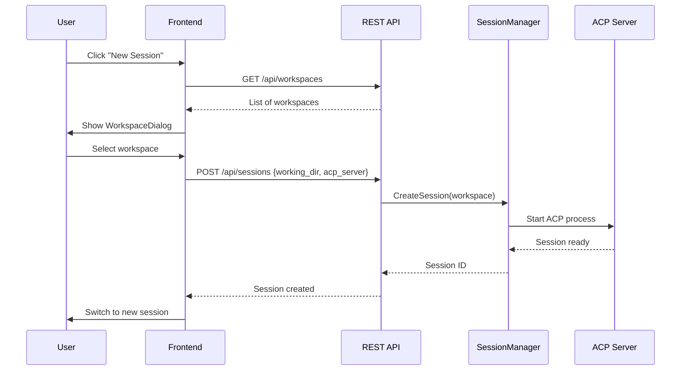

# Multi-Workspace Architecture

The web interface supports multiple workspaces, where each workspace pairs a directory with an ACP server. This enables running different AI agents for different projects simultaneously.

## Workspace Configuration



## CLI Usage

```bash
# Single workspace (uses default ACP server and current directory)
mitto web

# Multiple workspaces with explicit directories
mitto web --dir /path/to/project1 --dir /path/to/project2

# Specify ACP server per workspace (server:path syntax)
mitto web --dir auggie:/path/to/project1 --dir claude-code:/path/to/project2

# Mix default and explicit servers
mitto web --dir /path/to/project1 --dir claude-code:/path/to/project2
```

## Workspace REST API

| Method | Endpoint | Description |
|--------|----------|-------------|
| GET | `/api/workspaces` | List all workspaces and available ACP servers |
| POST | `/api/workspaces` | Add a new workspace dynamically |
| DELETE | `/api/workspaces?dir=...` | Remove a workspace |

### GET /api/workspaces Response

```json
{
  "workspaces": [
    {
      "acp_server": "auggie",
      "acp_command": "auggie --acp",
      "working_dir": "/path/to/project1"
    },
    {
      "acp_server": "claude-code",
      "acp_command": "npx -y @zed-industries/claude-code-acp@latest",
      "working_dir": "/path/to/project2"
    }
  ],
  "acp_servers": [
    {"name": "auggie", "command": "auggie --acp"},
    {"name": "claude-code", "command": "npx -y @zed-industries/claude-code-acp@latest"}
  ]
}
```

### POST /api/workspaces Request

```json
{
  "working_dir": "/path/to/new/project",
  "acp_server": "auggie"
}
```

## Session Creation with Workspaces

When multiple workspaces are configured:

1. User clicks "New Session" button
2. If multiple workspaces exist, `WorkspaceDialog` opens for selection
3. User selects a workspace (directory + ACP server)
4. Session is created with the selected workspace's ACP server
5. Session metadata stores `working_dir` and `acp_server`



## WorkspaceConfig Type

```go
// WorkspaceConfig represents an ACP server + working directory pair.
type WorkspaceConfig struct {
    // ACPServer is the name of the ACP server (from .mittorc config)
    ACPServer string `json:"acp_server"`
    // ACPCommand is the shell command to start the ACP server
    ACPCommand string `json:"acp_command"`
    // WorkingDir is the absolute path to the working directory
    WorkingDir string `json:"working_dir"`
}
```

## SessionManager Workspace Methods

| Method | Description |
|--------|-------------|
| `GetWorkspaces()` | Returns all configured workspaces |
| `GetWorkspace(workingDir)` | Returns workspace for a specific directory |
| `GetDefaultWorkspace()` | Returns the first (default) workspace |
| `AddWorkspace(ws)` | Dynamically adds a new workspace at runtime |
| `RemoveWorkspace(workingDir)` | Removes a workspace by directory path |

## Workspace Persistence

Workspaces are persisted to `workspaces.json` when:
- Running the macOS app (always persists changes)
- Running CLI without `--dir` flags (loads from and saves to file)

Workspaces are NOT persisted when:
- Running CLI with `--dir` flags (CLI flags take precedence)

**workspaces.json:**
```json
{
  "workspaces": [
    {
      "acp_server": "auggie",
      "acp_command": "auggie --acp",
      "working_dir": "/path/to/project"
    }
  ]
}
```

