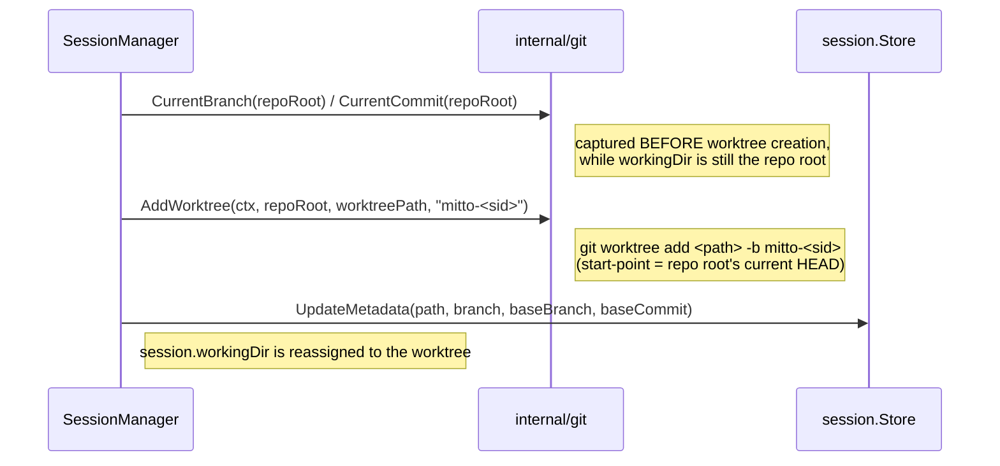

# Per-Conversation Git Worktrees

Mitto can run each conversation in its own isolated **git worktree** so that
parallel conversations edit the same repository without stepping on each other's
working tree or branch. This document covers the **branch strategy** and the
**flow-back** (merge/rebase/PR) mechanism. For the sandbox/restricted-runner
interaction (how the worktree and the shared `.git` metadata are made writable),
see [Restricted Runner Integration](restricted-runners.md).

## Enabling

Worktree isolation is a **per-workspace** opt-in. The toggle is
`worktrees_enabled` on the workspace settings (`internal/config/workspaces.go`,
JSON/YAML tag `worktrees_enabled`, accessor `GetWorktreesEnabled()`), persisted
in `workspaces.json`. It is **off by default** (nil/false). When off, a
conversation runs directly in the workspace folder, exactly as before, and none
of the worktree metadata below is populated.

## Lifecycle

### Branch naming

The per-conversation branch is `mitto-<sessionID>`
(`git.BranchName(sessionID)` → format `"mitto-%s"`, no extra sanitization — the
session ID is already filesystem/ref-safe). Example: session `abc123` →
branch `mitto-abc123`.

### Worktree location

Worktrees live **in-project**, under the repository's `.mitto` directory:
`appdir.SessionWorktreePath(repoRoot, sessionID)` →
`<repoRoot>/.mitto/worktrees/<sessionID>`. Keeping worktrees inside the
repository (rather than the centralized `<MITTO_DIR>/worktrees`) improves
filesystem locality and keeps each worktree under the workspace's
restricted-runner write scope (`$MITTO_WORKING_DIR`), so no separate sandbox
allow-list entry is needed for the worktree itself.

Because worktrees now sit inside the working tree, the `.mitto/worktrees/` path
is **auto-gitignored** on first worktree creation to avoid `git status`
pollution in the main checkout. On the first successful `AddWorktree`,
`git.EnsureGitignored(repoRoot, ".mitto/worktrees/", …)` checks
`git check-ignore` first and appends the pattern to `<repoRoot>/.gitignore` only
when not already ignored (so repos that already ignore `.mitto/` are left
untouched). It is best-effort: a failure logs a warning but does not abort
worktree creation.

### Base-branch policy: current HEAD at creation, stored

When the worktree is created, Mitto records **where it branched from** so that
flow-back can later target the right place even if the main checkout moves on:

- `git.CurrentBranch(repoRoot)` → `WorktreeBaseBranch`
  (empty when the repo root is on a **detached HEAD**).
- `git.CurrentCommit(repoRoot)` → `WorktreeBaseCommit` (full 40-char SHA).

Both are captured **before** `AddWorktree`, while `workingDir` still points at
the repo root. The new branch is created from the repo root's current HEAD
(`git worktree add <path> -b <branch>`, no explicit start-point), so the base
commit is the HEAD at creation time.

### Persisted metadata

`session.Metadata` (`internal/session/types.go`) carries four worktree fields,
all `omitempty`:

| Field                | JSON tag               | Meaning                                              |
| -------------------- | ---------------------- | ---------------------------------------------------- |
| `WorktreePath`       | `worktree_path`        | Absolute path to the conversation's worktree         |
| `WorktreeBranch`     | `worktree_branch`      | The `mitto-<sid>` branch the worktree runs on        |
| `WorktreeBaseBranch` | `worktree_base_branch` | Flow-back target branch (empty if base was detached) |
| `WorktreeBaseCommit` | `worktree_base_commit` | Commit SHA the worktree was created from             |

## Cleanup

Orphaned worktrees are reaped at server startup by
`recoverOrphanedWorktrees` (`internal/web/worktree_recovery.go`). Since
worktrees are in-project there is no single directory to scan; instead it
derives the candidate worktree roots from the `WorktreePath` of every known
session (their parent `<repoRoot>/.mitto/worktrees` dir) and scans each for
`<sessionID>` directories whose session no longer exists. A genuine linked
worktree (identified by a `.git` **file** gitdir pointer) is removed via
`git.RemoveWorktree` (`git worktree remove -f <path>`) and `git.DeleteBranch`
(`git branch -D <branch>`); a stray plain directory — which would otherwise
resolve to the enclosing repo by ancestry — is removed directly. Stale worktree
metadata for sessions whose worktree directory has disappeared is also cleared.

A repository whose sessions have all been removed is not discovered (no known
session points at its worktree root); such fully-orphaned roots are expected to
have been cleaned by the per-session delete path already.

## Flow-back (agent-driven)

Mitto does **not** implement server-side merge/rebase/PR logic. The flow-back is
performed by the agent in its shell, guided by the built-in **"Submission of
changes"** prompts. The conversation's stored base branch is exposed to those
prompts as a variable so they target the correct place.

### Prompt variables

The base/branch/path are surfaced through `@mitto:` substitution
(`internal/processors/variables.go`, fields on `ProcessorInput` in
`internal/processors/input.go`, populated from metadata in
`background_session.go`):

- `@mitto:worktree_branch` — this conversation's worktree branch, empty if not isolated.
- `@mitto:worktree_base_branch` — branch the worktree was created from (flow-back target), empty if none.
- `@mitto:worktree_path` — absolute path to the worktree, empty if none.

### Submission prompts

`config/prompts/builtin/submit-changes.md` and `rebase-changes.md`:

- **Git-gated** via
  `enabledWhen: 'fileExists(".git/config") || fileExists(".git")'`. The second
  term is required for **linked worktrees**, where `.git` is a _file_ (a gitdir
  pointer) and `.git/config` does **not** exist under the worktree — so the
  prompts stay visible exactly where flow-back is needed.
- When `@mitto:worktree_base_branch` is set, they **skip feature-branch
  creation** (the conversation is already on its own branch) and use the stored
  base as the PR/rebase target, taking priority over the usual
  `upstream`/`origin`/tracking-branch inference.

`config/prompts/builtin/merge-to-main.md` (group **"Git"**, "Merge to base branch"):

- Gated on `enabledWhen: 'session.hasWorktree'` — the `session.hasWorktree` CEL
  variable is `true` only when the conversation has its **own** worktree
  (owner-only; children that merely inherit a parent's worktree dir have an empty
  `WorktreePath` and so this is `false` for them).
- Agent-driven, **local merge only**: it merges `@mitto:worktree_branch` into
  `@mitto:worktree_base_branch` (falling back to the repo's default branch when the
  stored base is empty), running the merge from the **main checkout** (not inside the
  worktree). It does **not** push, open a PR, or remove the worktree.

### UI affordance

The Changes tab of the Session panel shows a `<branch> → <base>` line and a
**"Submit changes"** button when the conversation is in a worktree. The button
enqueues the built-in "Submit changes" prompt for the conversation (same queue
path as context-menu prompts). The worktree fields reach the frontend via the
WebSocket `connected` message (`internal/web/session_ws.go`) and are stored in
`session.info` by `useWebSocket.js`.
