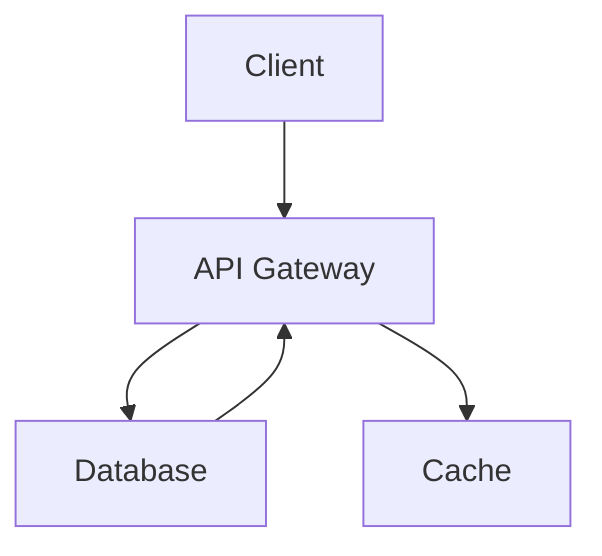

# Architecture

This document describes the system architecture of the Project Alpha application.

## Overview

The system follows a standard three-tier architecture with a client layer, an
API gateway for routing and authentication, and a backend database for persistence.

## System Diagram

## Components

### Client

The client layer handles user-facing interactions. It communicates with the
backend exclusively through the API Gateway.

### API Gateway

The API Gateway acts as the single entry point for all client requests. It
handles authentication, rate limiting, and request routing to downstream services.

### Database

The Database stores persistent application data. All reads and writes go through
the API Gateway to ensure consistent access control.

### Cache

The Cache layer reduces load on the Database by storing frequently accessed data
with a short TTL.
